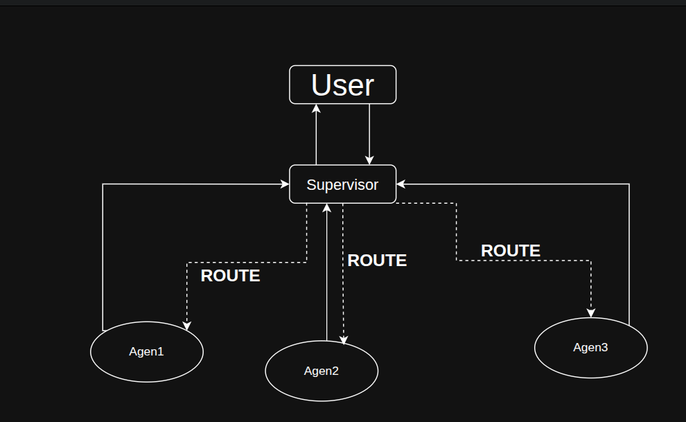
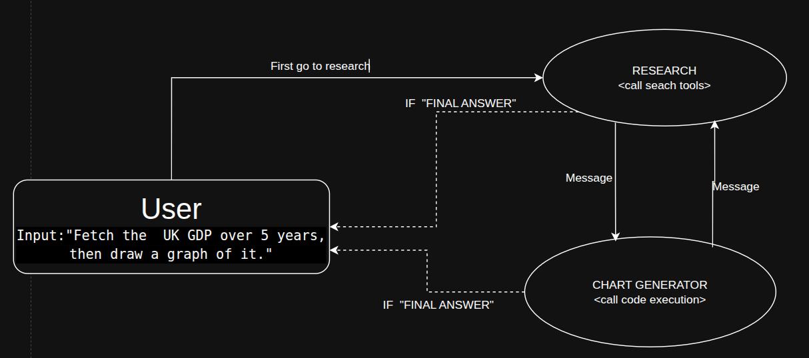
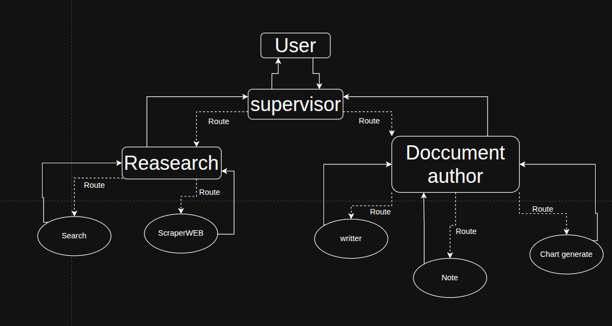

# 🤖 Multi-Agent Workflow Demonstrations in LangGraph
Implementing multi-agent workflows using LangGraph. 
Each example highlights specific orchestration approaches to help developers understand and build collaborative AI systems.


## 📋 Features

### Agent Supervision
-  Models a supervisor-worker relationship for intelligent task delegation
- Routes tasks between research and coding agents based on requirements
- Manages conversation flow with clear transitions between agents
- Makes real-time decisions about which agent should act next

### Multi-Agent Collaboration
- Enables direct peer-to-peer collaboration between agents
- Shares tools and information across collaborating agents
- Demonstrates fluid conversation flow between specialized agents
- Facilitates tool calling between different agent types

### Hierarchical Agent Teams
- Orchestrates complex workflows with multiple levels of supervision
- Seamlessly coordinates specialized agent teams (research, document writing)
- Efficiently delegates tasks to lower-level agents with appropriate tools
- Follows proper escalation and reporting paths in the agent hierarchy

## 🏗️ Architecture
### Agent Supervision



### Multi-Agent Collaboration



### Hierarchical Agent Teams



## 📦 Implementation Details
### Agent_supervisor
This demonstration implements a supervisor-worker architecture:

- **Supervisor Agent**: Makes routing decisions about which agent to activate
- **Research Agent**: Uses search tools to gather information
- **Coding Agent**: Executes Python code for calculations and analysis
- **Decision Logic**: Shows how to implement routing logic for multi-agent systems

### Multi_agent_collaboration.py
This demonstration implements a peer-to-peer collaborative agent system:

- **Researcher Agent**: Gathers data from web sources
- **Chart Generator Agent**: Creates visualizations from research data
- **Tool Sharing**: Shows how tools can be used across agent boundaries
- **Collaborative Workflow**: Demonstrates agents working together on a shared task
### Hierarchical_agent_teams
This demonstration implements a sophisticated hierarchical team structure with multiple levels of supervision:

- **Top-level Supervisor**: Coordinates between specialized teams
- **Research Team**: Combines web search and web scraping capabilities 
- **Document Writing Team**: Creates, edits and manages document creation
- **Tool Integration**: Implements document creation/editing tools, search tools, and web scraping
- **State Management**: Shows how to manage complex state across the hierarchy


## 🛠️ Requirements

- Python 3.9+
- OpenAI API key
- Tavily API key 
- LangChain and LangGraph libraries

## 📦 Installation
```bash

# Install dependencies
pip install -r requirements.txt

export OPENAI_API_KEY="your-openai-api-key"
export TAVILY_API_KEY="your-tavily-api-key"

# Optional: Enable LangChain tracing
LANGSMITH_TRACING=true
LANGSMITH_ENDPOINT=https://eu.api.smith.langchain.com
LANGSMITH_API_KEY="your-LANGSMITH-api-key"
LANGSMITH_PROJECT="my_multi_agent"

ANTHROPIC_API_KEY=<your-anthropic-api-key>
```


## 🚀 Usage
```python
python -m agent_supervisor.agent_system

```

```python
python -m multi_agent_collaboration.multi_collaboration
```
```python
python -m hierarchical_agent_team.merger_super_agent

```